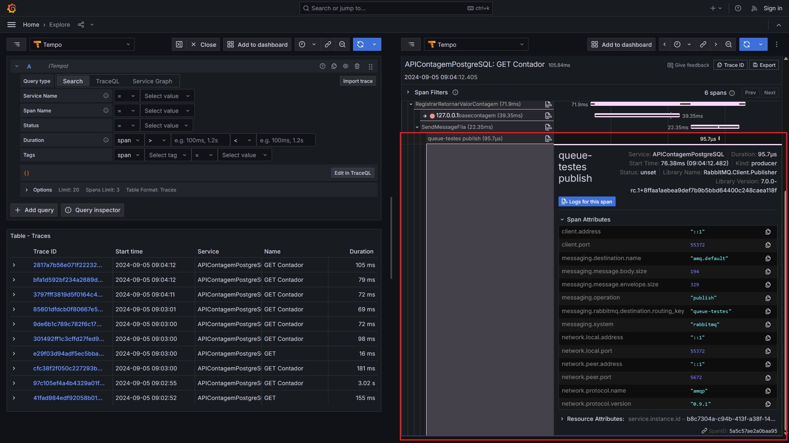

# ASPNETCore8-OpenTelemetry-Grafana-Tempo-Loki-RabbitMQ-PostgreSQL_APIContagem
Exemplo de uso de OpenTelemetry + Grafana + Tempo + Loki + RabbitMQ com .NET 8, ASP.NET Core, APIs REST e PostgreSQL em uma API de contagem de acessos. Esta aplicação demonstra a implementação de distributed tracing com o Grafana Tempo e logging com o Grafana Loki, incluindo o monitoramento no uso de filas.

## Exemplo de trace

O Span gerado pelo package [**RabbitMQ.Client.OpenTelemetry**](https://www.nuget.org/packages/RabbitMQ.Client.OpenTelemetry/1.0.0-rc.1) (**NuGet**) está destacado em vermelho:

